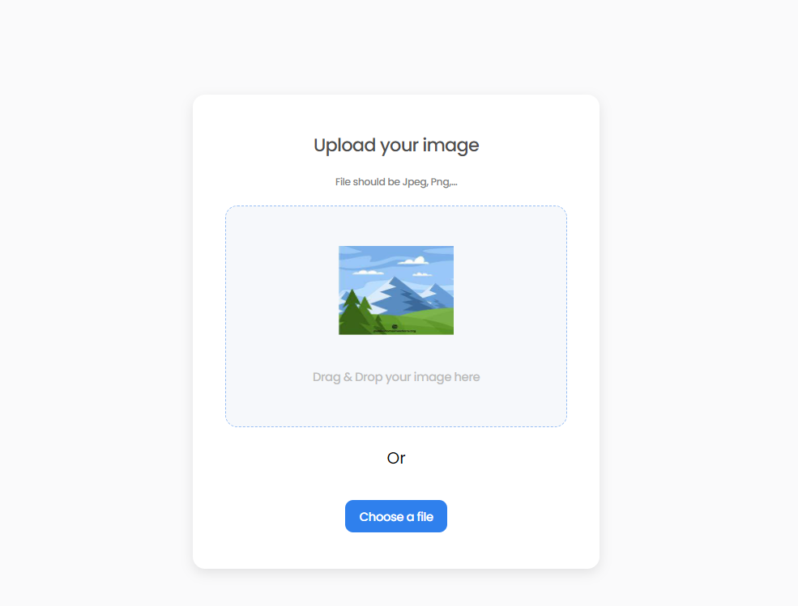

## Table of Contents

-   [Overview](#overview)
    -   [Built With](#built-with)
-   [Features](#features)
-   [How to use](#how-to-use)
-   [Contact](#contact)
-   [Acknowledgements](#acknowledgements)

<!-- OVERVIEW -->

## Overview



Introduce your projects by taking a screenshot or a gif. Try to tell visitors a story about your project by answering:

-   Where can I see your demo?

    -   [Live Demo](https://robert-image-uploader.netlify.app/)

-   What was your experience?

    Working in a fullstack application was a great experience. I learned a lot about how to connect the frontend and backend together. I also learned how to use multer to upload files to the backend. Finally I also learned how to use the clipboard API to copy the image link to the clipboard.

    Using typescript to type check my code was a challenge, specially in the build process since I had problems with some dependencies but in the end I learned a lot about how to use typescript in a fullstack application.

-   What have you learned/improved?

    I leveled up my backend skills (specially API design) by learning how to upload files to the backend with the help of multer middleware, how to handle files in the browser.
    In terms of DevOps, I already knew how to deploy a frontend application to netlify, but I learned how to deploy a fullstack application to render.com
    and configure both the frontend and backend to work together.

-   Your wisdom?

    For personal projects like this where you want to show off your skills, I think it's best to use a fullstack application. It's a great way to show off your skills and it's a great way to learn how to connect the frontend and backend together.

    If you already are a frontend developer and want to learn backend, I recommend using NodeJs + express.js. In that way you can use your javascript skills to build the backend, altough I recommend using typescript to type check your code.

    In terms of databases I recommend using a cloud database like MongoDB Atlas. It's easy to set up and it's free to use, another alternative is Firebase.

### Built With

<!-- This section should list any major frameworks that you built your project using. Here are a few examples.-->

#### Frontend

-   [React](https://reactjs.org/) - JS library
-   [Typescript](https://www.typescriptlang.org/) - For type checking
-   [Sass](https://sass-lang.com/) - For styles
-   [React Dropzone](https://react-dropzone.js.org/) - For file upload
-   [ImgBB](https://imgbb.com/) - For image hosting
-   [Vite](https://vitejs.dev/) - For development server

#### Backend

-   [Node.js](https://nodejs.org/en/) - JavaScript runtime environment
-   [Express](https://expressjs.com/) - Node.js framework
-   [Multer](https://www.npmjs.com/package/multer) - For file upload
-   [Typescript](https://www.typescriptlang.org/) - For type checking
-   [MongoDB Atlas](https://www.mongodb.com/cloud/atlas) - For database
-   [Mongoose](https://mongoosejs.com/) - For database modeling

## Features

-   Users can drag and drop an image to upload it
-   Users can choose to select an image from my folder
-   Users can see a loader when uploading
-   When the image is uploaded, I can see the image and copy it
-   Users can choose to copy to the clipboard

This application/site was created as a submission to a [DevChallenges](https://devchallenges.io/challenges) challenge. The [challenge](https://devchallenges.io/challenges/O2iGT9yBd6xZBrOcVirx) was to build an application to complete the given user stories.

## How To Use

<!-- Example: -->

To clone and run this application, you'll need [Git](https://git-scm.com) and [Node.js](https://nodejs.org/en/download/) (which comes with [npm](http://npmjs.com)) installed on your computer.

From your command line, in the root directory of the project, run the following commands to start the backend:

```bash
# Clone this repository - this branch is a fully frontend application
$ git clone https://github.com/Robertron624/image-uploader-fullstack/tree/feat/frontend

# Install dependencies
$ npm install

# Run the app
$ npm run start

# Or build for production
$ npm run build

```

The frontend lives in the image-uploader-frontend folder. To start the frontend, go to that folder and run the following commands:

```bash

# Install dependencies
$ npm install

# Run the app
$ npm run dev

# Or build for production
$ npm run build

```

## Acknowledgements

-   [Steps to replicate a design with only HTML and CSS](https://devchallenges-blogs.web.app/how-to-replicate-design/)

-   [React Documentation](https://reactjs.org/docs/getting-started.html)

-   [Build a drag-and-drop image uploader with react-dropzone](https://blog.logrocket.com/create-drag-and-drop-component-react-dropzone/) - I used this to help me with the file upload

-   [How to create a custom toast component with React](https://blog.logrocket.com/how-to-create-custom-toast-component-react/) - Instead of using a library for the toast (like react-toastify), I decided to create my own component to keep bundle size down.

-   [aunva312 image uploader challenge](https://github.com/anuva312/ImageUploader-devChallenges) - I used this as a reference to see how to connect the frontend and backend together.

-   [Build a REST API with Node.js: Upload an Image File](https://lo-victoria.com/build-rest-api-with-nodejs-upload-files-mongodb), [File uploading in Node.js](https://www.geeksforgeeks.org/file-uploading-in-node-js/) - I used these to help me with the backend file upload.

## Contact

-   Website [Robert Ramirez](https://robert-ramirez.co)
-   GitHub [@Robertron624](https://github.com/Robertron624)
-   Twitter [@robertdowny](https://www.twitter.com/robertdowny)
