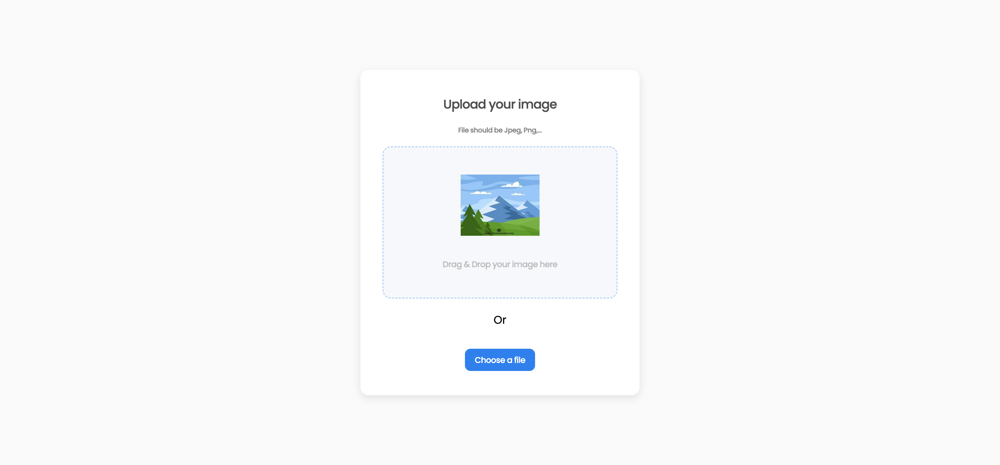

## Table of Contents

- [Overview](#overview)
  - [Built With](#built-with)
- [Features](#features)
- [How to use](#how-to-use)
- [Contact](#contact)
- [Acknowledgements](#acknowledgements)

<!-- OVERVIEW -->

## Overview




- Where can I see your demo?


- What was your experience?
  Creating this project was a lot of fun. I learned a lot about React and how to use the FileReader API to read the file, manage the three application states (idle, loading, success), and upload the file to ImgBB.
  Because the figma design is locked, I had to make some changes to the design (placeholder image and checkmark circle icon). I also added a toast component to show the user when the image is uploaded and when the link is copied to the clipboard.

- What have you learned/improved?
  I learned to use drag and drop in React, I learned how to use the FileReader API to read the file and convert it to a base64 string and then upload it to ImgBB
  
  .I also learned how to use the clipboard API to copy the image link to the clipboard. I also learned how to create a custom toast component in React.

- Your wisdom?
If you are only planning on using the frontend, you can use ImgBB's API to upload the image and get the link, it will save you time and money.
I recommend to create your own custom toast component instead of using a library like react-toastify. It will keep your bundle size down, it will be easier to customize, and you will learn a lot.
Make use of TypeScript features like interfaces, types and enums. It will save you a lot of time and headaches.

### Built With

<!-- This section should list any major frameworks that you built your project using. Here are a few examples.-->

#### Frontend
- [React](https://reactjs.org/) - JS library
- [Sass](https://sass-lang.com/) - For styles
- [React Dropzone](https://react-dropzone.js.org/) - For file upload
- [ImgBB](https://imgbb.com/) - For image hosting
- [Vite](https://vitejs.dev/) - For development server

#### Backend
This branch was developed using ImgBB's image hosting API. 
In another branch I will create a backend using Node.js and Express.js to handle the image upload and hosting.
The API key is stored in a .env file. The .env file is not included in this repository. If you would like to run this project locally, you will need to create a .env file in the root directory and add the following:

## Features

- Users can drag and drop an image to upload it
- Users can choose to select an image from my folder
- Users can see a loader when uploading
- When the image is uploaded, I can see the image and copy it
- Users can choose to copy to the clipboard


This application/site was created as a submission to a [DevChallenges](https://devchallenges.io/challenges) challenge. The [challenge](https://devchallenges.io/challenges/O2iGT9yBd6xZBrOcVirx) was to build an application to complete the given user stories.

## How To Use

<!-- Example: -->

To clone and run this application, you'll need [Git](https://git-scm.com) and [Node.js](https://nodejs.org/en/download/) (which comes with [npm](http://npmjs.com)) installed on your computer. From your command line:

```bash
# Clone this repository - this branch is a fully frontend application
$ git clone https://github.com/Robertron624/image-uploader-fullstack/tree/feat/frontend

# Install dependencies
$ npm install

# Run the app
$ npm run dev
```

## Acknowledgements

- [Steps to replicate a design with only HTML and CSS](https://devchallenges-blogs.web.app/how-to-replicate-design/)

- [React Documentation](https://reactjs.org/docs/getting-started.html)

- [Build a drag-and-drop image uploader with react-dropzone](https://blog.logrocket.com/create-drag-and-drop-component-react-dropzone/) - I used this to help me with the file upload

- [How to create a custom toast component with React](https://blog.logrocket.com/how-to-create-custom-toast-component-react/) - Instead of using a library for the toast (like react-toastify), I decided to create my own component to keep bundle size down.

## Contact

- Website [Robert Ramirez](https://robert-ramirez.netlify.app)
- GitHub [@Robertron624](https://github.com/Robertron624)
- Twitter [@robertdowny](https://www.twitter.com/robertdowny)